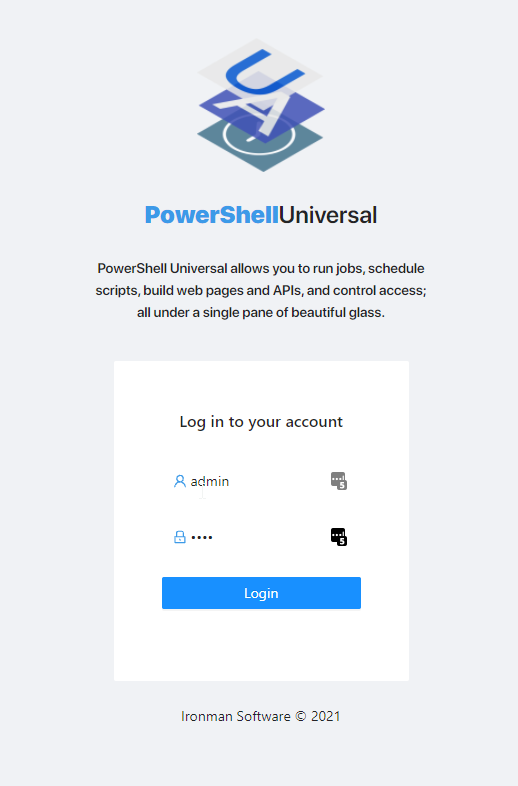

# powershell-rest-api

## Documentation Powershell Universal

https://docs.powershelluniversal.com/get-started

## Powershell Admin Console

http://localhost:5000/login
Authentication: admin/admin  

## Visual Studio Code Extensions

Name: PowerShell
Id: ms-vscode.PowerShell
Description: Develop PowerShell modules, commands and scripts in Visual Studio Code!
Version: 2023.6.0
Publisher: Microsoft
VS Marketplace Link: https://marketplace.visualstudio.com/items?itemName=ms-vscode.PowerShell

Name: PowerShell Universal
Id: ironmansoftware.powershell-universal
Description: Visual Studio Code tools for PowerShell Universal
Version: 3.1.0
Publisher: Ironman Software
VS Marketplace Link: https://marketplace.visualstudio.com/items?itemName=ironmansoftware.powershell-universal
